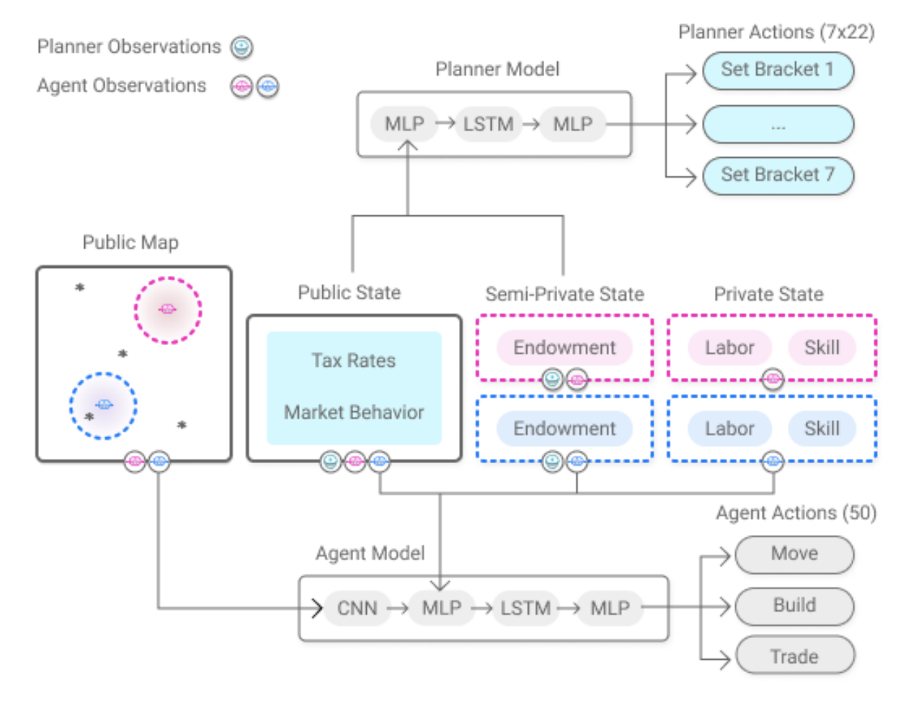

Copyright (c) 2021, salesforce.com, inc.  
All rights reserved.  
SPDX-License-Identifier: BSD-3-Clause  
For full license text, see the LICENSE file in the repo root or https://opensource.org/licenses/BSD-3-Clause

# Prerequisites

It is helpful to be familiar with **Foundation**, a multi-agent economic simulator built for the [AI Economist](https://arxiv.org/abs/2108.02755). If you haven't worked with Foundation before, we recommend taking a look at our other tutorials:

- [Foundation: the Basics](https://github.com/salesforce/ai-economist/blob/master/tutorials/economic_simulation_basic.ipynb)
- [Extending Foundation](https://github.com/salesforce/ai-economist/blob/master/tutorials/economic_simulation_advanced.ipynb)
- [Optimal Taxation Theory and Simulation](https://github.com/salesforce/ai-economist/blob/master/tutorials/optimal_taxation_theory_and_simulation.ipynb)

# Introduction

This tutorial shows how to: 

1. do distributed multi-agent reinforcement learning (MARL) with [RLlib](https://github.com/ray-project/ray/tree/master/rllib), and 
2. implement two-level curriculum learning as used in the [paper](https://arxiv.org/abs/2108.02755): "The AI Economist: Optimal Economic Policy Design via Two-level Deep Reinforcement Learning". 

Before you begin, it will be helpful to be familiar with the basics of using RLlib, for example setting up a PPO Trainer object. We explain this in our [introductory RLlib tutorial](https://github.com/salesforce/ai-economist/blob/master/tutorials/multi_agent_training_with_rllib.ipynb).

Here, we will cover some advanced topics including:

1. using custom models, and
2. stabilizing RL training with two-level curriculum learning.

We will also show how to run training and the required configurations to get the results in the [AI-Economist paper](https://arxiv.org/abs/2108.02755).

## Use Custom Models with RLlib

By default, RLlib uses built-in [models and preprocessors](https://docs.ray.io/en/releases-0.8.4/rllib-models.html#built-in-models-and-preprocessors) to process agent observations. These preprocessors work with common shapes of the observation tensors.

However, we often use customized models to process more complicated, structured observations. In the [AI-Economist paper](https://arxiv.org/abs/2108.02755), we combine convolutional, fully connected, and recurrent layers to process spatial, non-spatial, and historical information, respectively. For recurrent components, each agent maintains its own hidden state. This is visualized below. 



RLlib also supports to add your own [custom recurrent](https://docs.ray.io/en/releases-0.8.4/rllib-models.html?highlight=custom%20models#recurrent-models) TensorFlow (TF) models. Custom TF models are subclasses of `RecurrentTFModelV2`, which implement `__init__()`, `get_initial_state()` and `forward_rnn()` methods. We implemented [two custom models](rllib/tf_models.py) in Keras:  

1. a `random` model to sample actions from an action space at random (e.g., used when not training an agent), and 
2. `keras_conv_lstm`, which implements the architecture shown above. 

## Stabilize RL Training with Two-Level Curriculum Learning

In our [paper](https://arxiv.org/abs/2108.02755), we use two-level RL to train agents and a social planner in an economic simulation.

The agents optimize their post-tax utility by working (labor) and earning taxable income. The planner optimizes social welfare by setting income tax rates. The agents need to adapt to policies set by the planner, and vice versa. This is a challenging learning problem because agents need to optimize behavior in a non-stationary environment. That is, if the planner changes the tax policy, it may change the reward that agents experience. In addition, learning can be unstable because both agents and planner explore. As such, designing a planner policy when the agents learn too leads to highly unstable RL.

Our learning approach stabilizes training using two key insights:

1. agents should not face significant utility costs that discourage exploration early during learning, and
2. the agents and social planner should be encouraged to gradually explore and co-adapt.

To stabilize learning, we combine two key ideas: curriculum learning and entropy regularization.

Curriculum learning effectively staggers agent and planner learning such that agents are well-adapted to a wide range of tax settings before the learning of the planner begins. First, labor costs first gradually increase. After these costs are fully enabled, taxes are gradually enabled. These curricula are effective because suboptimal agent behavior may experience substantially negative utility because of punitively high labor costs and taxes, while earning insufficient income. This may discourage RL agents from continuing to learn (when using on-policy learning).

We schedule the planner's entropy regularization to expose agents to highly random taxes initially. This allows the agents to appropriately condition actions for a wide range of possible tax rates. This helps agents respond better to a planner that behaves non-randomly. Lastly, the entropy of the agent and planner policies are balanced to encourage exploration and gradual co-adaptation.

In practice, we follow a two-phased approach to training.

### Phase One

In phase one, we only train the agent policies (from scratch) without taxes (free market). This is done by setting `disable_taxes=True` for the [PeriodicBracketTax](https://github.com/salesforce/ai-economist/blob/master/ai_economist/foundation/components/redistribution.py#L86) component.

Agents also use a curriculum in phase one that anneals labor costs. This is because many actions cost labor, but few yield income. Hence, a suboptimal policy can experience too much labor cost and converge to doing nothing without a curriculum. You can enable the curriculum by setting `energy_warmup` environment configuration parameters in the [Simple Wood-and-Stone Scenario](https://github.com/salesforce/ai-economist/blob/master/ai_economist/foundation/scenarios/simple_wood_and_stone/layout_from_file.py#L47).

### Phase Two

In phase two, agents continue to learn, starting from the final model checkpoint of phase one. The planner now also begins to learn. We also anneal the maximum marginal tax to prevent planners from setting extremely high taxes during exploration. High taxes can reduce post-tax income to zero and discourage agents from improving their policy. You can enable this using the `tax_annealing_schedule` parameter in the [PeriodicBracketTax](https://github.com/salesforce/ai-economist/blob/master/ai_economist/foundation/components/redistribution.py#L118) component.

We also regularize entropy to prevent agent and planner policies from prematurely converging and to promote co-adaption. We use high planner entropy regularization initially to let agents learn appropriate responses to a wide range of tax levels. After this initial phase, we gradually allow the planner to lower its entropy and optimize its policy. RLlib provides an `entropy_coeff_schedule` [configuration parameter](https://docs.ray.io/en/releases-0.8.4/rllib-algorithms.html?highlight=PPO#proximal-policy-optimization-ppo) to specify an [entropy schedule](https://github.com/ray-project/ray/blob/releases/0.8.4/rllib/policy/tf_policy.py#L697).
   
## Run Training

### Hardware

All our experiments were run on an [`n1-standard-16` machine](https://cloud.google.com/compute/docs/general-purpose-machines#n1_machines) on Google Cloud Platform, with 16 CPUs and 60 GB of memory. We used 15 roll-out workers and 1 trainer worker for our experiments.

### Dependencies

We recommend installing a fresh conda environment (for example, `ai-economist-training`), and installing these requirements:

```shell
conda create --name rllib-training python=3.7 --yes
conda activate ai-economist-training

pip install ai-economist>=1.5
pip install gym==0.21
pip install tensorflow==1.14
pip install "ray[rllib]==0.8.4"
```

### Training Script

Here is the [training script](rllib/training_script.py) used to launch the experiment runs in our [paper](https://arxiv.org/abs/2108.02755). This script is similar to our [basic](https://github.com/salesforce/ai-economist/blob/master/tutorials/multi_agent_training_with_rllib.ipynb) tutorial. Specifically, it performs the following:

1. Add the environment's observation and action space attributes via the RLlib environment wrapper.
2. Instantiate a PPO trainer with the relevant trainer configuration.
3. Set up directories for dense logging and saving model checkpoints.
4. Invoke ```trainer.train()```.
5. Store the environment's dense logs and the model checkpoints continually, depending on the saving frequency.

For two-level curriculum learning, the training script needs to be run twice, and sequentially, for phase 1 and phase 2 training.

### Run Configurations

See the complete run configurations we used here: [Phase One](rllib/phase1/config.yaml) and [Phase Two](rllib/phase2/config.yaml).

The configuration files we have provided with this tutorial are for the 4-agent Gather-Trade-Build environment in the `Open-Quadrant` setting using an RL planner. A detailed description of all the configuration parameters is provided [here](rllib/run_configuration_parameter_descriptions.md).

### Step 1: Run Phase One

The training script an argument, `run-dir`, which refers to the run directory containing the training configuration file `config.yaml`. That is also the directory where the experiment results are saved. To run phase one, do:

```shell
python training_script.py --run-dir phase1
```

Running this command also creates the `ckpts` and `dense_logs` sub-folders inside the `phase1` folder, and populates them during training. Recall that during this phase, we train the agents (and not the planner), so only the agent policy model weights are saved during training.

### Step 2: Run Phase Two

In phase two, agents continue to learn starting from the model checkpoint at the end of phase one, and the planner is also trained.

Important: Please set `env_config['general']['restore_tf_weights_agents']` to the full path for the agent checkpoint file obtained at the end of phase one. If phase one completes successfully, the final model checkpoint file should be in ```phase1/ckpts/agent.tf.weights.global-step-25000000``` (with the phase one configuration provided above). Otherwise, you may also set it to a valid agent checkpoint file, and the training script will initialize the agent model with that checkpoint. To run phase two, do:

```shell
python training_script.py --run-dir phase2
```

Running this command creates the `ckpts` and `dense_logs` sub-folders within the `phase2` folder, and populates them during training.

## Visualize Training Results

By default, as the training progresses, the training results are printed after every iteration and the results and metrics are also logged to a subdirectory inside `~/ray_results`. This subdirectory will contain a file `params.json` which contains the hyperparameters, a file `result.json` which contains a training summary for each episode, and a TensorBoard file that can be used to visualize training process. Run TensorBoard by doing:

```shell
tensorboard --logdir ~/ray_results
```

## Visualize Dense Logs

During training, the dense logs are saved in the experiment's `dense_logs` folder in a compressed (.lz4) format. We can use the [load utility function](https://github.com/salesforce/ai-economist/blob/master/ai_economist/foundation/utils.py#L51) in Foundation to parse the dense logs. Subsequently, we can use this [tutorial](https://github.com/salesforce/ai-economist/blob/master/tutorials/multi_agent_training_with_rllib.ipynb#Visualizing-the-episode-dense-logs) to visualize the dense logs.

Happy training!
